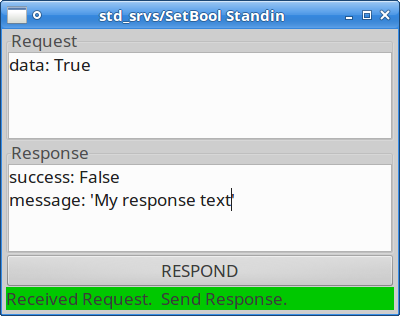

Synapticon rx_service_tools
===========================

This package provides a simple GUI to run an interactive service server.

It is based on the `axserver.py` of actionlib and works exactly the same, just
for services instead of actions.

Usage example:

    rosrun rx_service_tools rx_service_server /service_name std_srvs/SetBool

